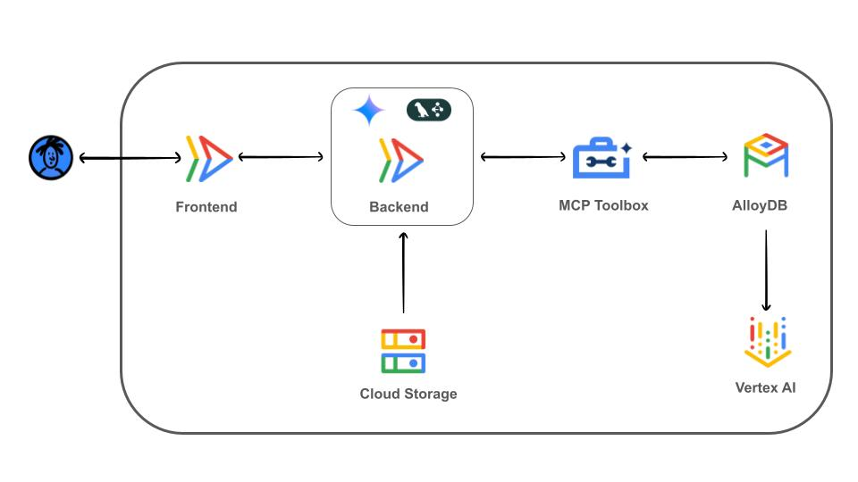

# Sports Shopping AI Agent

Note: This project is for demonstration only and is not an officially supported Google product.

## Introduction

This project showcases Finn, an AI Agent designed to revolutionize the sports shopping experience. Finn acts as your smart assistant, understanding your needs and guiding you through the entire shopping journey. It's not just a search bar; you simply chat with Finn to get things done, from recommending products to finding nearby stores, placing orders, and even updating delivery methods. This intelligent, conversational approach dramatically transforms the user experience, making shopping effortless and highly personalized.

## Table of Contents
<!-- TOC depthfrom:2 -->

- [Introduction](#introduction)
- [Table of Contents](#table-of-contents)
- [Understanding the demo](#understanding-the-demo)
- [Deploying](#deploying)
    - [Before you begin](#before-you-begin)
    - [Setting up your Database](#setting-up-your-database)
    - [Deploying MCP ToolBox](#deploying-mcp-toolbox)
    - [Deploying Finn Sports Agent AI](#deploying-finn-agent-ai)
    - [Running Finn Sports Agent AI](#running-finn-agent-ai)
    - [Customize the dataset](#customize-the-dataset)
    - [Clean up Resources](#clean-up-resources)

<!-- /TOC -->

## Understanding the demo
### AI Agent: Finn - Your Smart Shopping Assistant

Finn provides intelligent, text-based recommendations and assistance, transforming your shopping experience:

- **Natural Language Understanding**: Finn, powered by Gemini, interprets your conversational requests, understanding your preferences, questions about products, or even multi-step shopping needs.
- **Contextual Recommendations**: Leveraging product descriptions, categories, and brands stored in AlloyDB, Finn uses text embeddings (via pg_vector) and full-text search (GIN indexes) to find items that semantically match your query. It's about finding what you mean, not just what you type.
- **Intelligent Action Orchestration**: Beyond recommendations, Finn's agentic capabilities (orchestrated by LangGraph and connected to the database via MCP ToolBox) allow it to perform actions like: providing detailed product information, finding stores near a specific location using PostGIS, helping you place orders or assisting with delivery method updates.

Finn transforms passive shopping into an active, conversational experience, where your requests are understood and acted upon.

### AlloyDB: The Brains Behind the Data
AlloyDB for PostgreSQL isn't just a database here; it's the central intelligence hub providing unparalleled data capabilities for Finn:

- **Vector Search & Grounding**: Leveraging pg_vector extensions, AlloyDB stores and queries the high-dimensional embeddings generated by Vertex AI. This allows for semantic search, ensuring recommendations are truly relevant, and acts as a grounding source for the agent's decisions.
- **Advanced Search & SQL Richness**: Beyond vectors, AlloyDB's native support for GIN indexes powers lightning-fast full-text searches on product descriptions, categories, and brands. Its SQL richness allows for complex queries, enabling Finn to provide detailed product information, manage inventory across stores, and orchestrate the entire order lifecycle.
- **Geospatial Capabilities (PostGIS)**: With PostGIS, AlloyDB allows Finn to find stores near you, optimize delivery routes, and provide location-aware services, directly supporting the "find stores" and "delivery methods" parts of the user journey.
- **Scalability & Reliability**: As a fully-managed service, AlloyDB handles the heavy lifting, ensuring the agent performs flawlessly even with growing datasets and complex queries.

### MCP ToolBox for Databases: Connecting the Agent to the Database
MCP ToolBox plays a key role in simplifying the connection between Finn (our AI agent) and AlloyDB. It exposes a set of specialized functionalities, or "tools," that allow Finn to:

- **Access Product Data**: Seamlessly query the product catalog based on embeddings, keywords, or categories.
- **Manage Shopping & Orders**: Interact with the shopping_lists, inventory, orders, and delivery_methods tables to fulfill user requests like placing orders or checking stock.
- **Retrieve Store Information**: Use geographical data to find nearby stores and their details.

By abstracting complex database interactions into simple, callable "tools," MCP ToolBox empowers Finn to efficiently use AlloyDB's advanced capabilities without needing to understand the underlying SQL queries.

### Architecture


This architecture provides an image-based product recommendation and shopping system. It leverages Vertex AI to analyze images and generate meaningful representations of their visual content. These representations, along with all operational data, are stored in AlloyDB for fast, intelligent searches and comprehensive data management.

Here are the key components:

- **Cloud Run**: Hosts the frontend, backend and MCP ToolBox components of the agent service, providing a serverless platform for code execution.
- **MCP ToolBox for Databases**: Provides the necessary tools for LangGraph to interact with AlloyDB and other services.
- **AlloyDB for PostgreSQL**: Stores the data model with the catalog, user information, shopping lists, orders, store details and the embedding representation of the product descriptions. It provides high-performance, scalable storage, and advanced data retrieval for all agent functionalities.
- **LangGraph**: Orchestrates Finn's reasoning process, chaining together various tools and data sources to respond to user queries.
- **Vertex AI Embedding**: Generates the products descriptions embeddings.

## Deploying

Deploying this demo consists of 3 steps:

1. Creating your database and initializing it with data
2. Deploying MCP ToolBox service to CloudRun
3. Deploying Finn Agent AI using a Backend and the Frontend services to CloudRun

### Before you begin
Clone this repo to your local machine:
```
git clone https://github.com/mtoscano84/sports-store-agent-ai.git
```

### Setting up your Database
Finn Sports Agent AI Assistant leverages AlloyDB to persist the data, provides context and resolve user queries.

Follow these instructions to set up and configure the database

[Setting up your Database](docs/alloydb.md)

### Deploying MCP ToolBox
MCP ToolBox exposes a set of specialized functionalities, or "tools," that allow the agent to perform actions and access data.

Follow these instructions to deploy MCP ToolBox along with the Tools in CloudRun

[Deploying MCP ToolBox](docs/toolbox.md)

### Deploying Finn Sports Agent AI
Finn Sports Agent AI is composed of two Cloud Run Services:

1. **Frontend**: Provides an user interface to interact with the agent and the backend service.
2. **Backend**: This service hosts the core AI agent. It orchestrates user interactions with the different components to provide the answers.

To deploy Finn Sports Agent AI, follow these instructions:

[Deploy Finn Sports Agent AI](docs/deploy_app_services.md)

### Running Finn Sports Agent AI
Once Finn Sports Agent AI is deployed, you're ready to chat!
Start by asking Finn for product recommendations, asking questions about items, or even guiding you through finding a store and placing an order.


Here's a typical interaction flow:
- Hello, I’m Miguel

- I’m looking for running shoes for an ultra-trail

- Tell me more details about 'Ultra Glide'

- OK, add Ultra Glide, size 40, color Red/Grey to my shopping list

- Find stores near me

- Please, place an order using my shopping list for the store 'Sports Diagonal Mar'

- Check my orders status

- Please list delivery methods for 'Sports Diagonal Mar' 

- Update the delivery method to Express Delivery for my order

- Check my orders status

### Customize the dataset
This demo was built with a generic sports product catalog and fictional locations. If you'd like to tailor it, you can easily adapt the dataset to your specific needs.

Follow the instructions to customize it:

[Customize the dataset](./docs/customize_dataset.md)

### Clean up Resources
[Instructions for cleaning up resources](./docs/clean_up.md)

